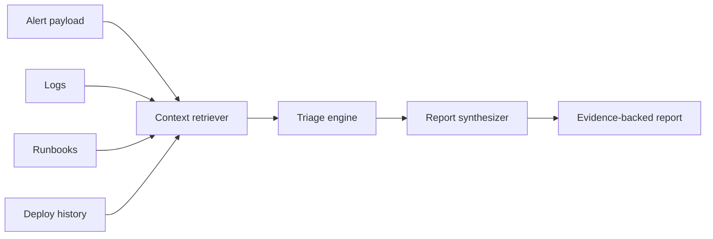

# Architecture Notes

## System Shape



## Design Choices

- The local retriever is deterministic so tests are stable and demos do not depend on network access.
- Evidence is ranked separately by source type, which keeps logs, runbooks, and deploys represented in the final report.
- Report synthesis is separated from retrieval so deterministic local behavior and future LLM behavior share the same evidence contract.
- The report carries assumptions explicitly because incident response decisions should not hide uncertainty.

## Production Evolution

In a production version, `TriageEngine` remains the orchestration layer and `LLMSynthesizer` becomes the model-backed report writer. That keeps the model behind a narrow contract:

1. Receive an alert, ranked evidence, and matching runbooks.
2. Produce structured output matching the `TriageReport` schema.
3. Reference supplied evidence for suspected causes.
4. Prefer runbook checks and mitigations for recommended actions.
5. Ask for human approval before risky actions.

The model-backed synthesizer can use tools for:

- `search_logs(service, query, window)`
- `query_metrics(service, metric, window)`
- `lookup_deploys(service, since)`
- `retrieve_runbooks(service, symptoms)`
- `create_incident_update(report)`

The model should not directly invent mitigations. It should choose from runbooks, attach supporting evidence, and request human approval for risky steps such as rollback, failover, policy bypass, or customer-impacting configuration changes.

## Code Boundary

```text
TriageEngine
  - retrieves context
  - selects matching runbooks
  - delegates report writing

ReportSynthesizer
  - DeterministicSynthesizer: local demo and regression baseline
  - LLMSynthesizer: production model integration point
```

## Evaluation Strategy

The `evals` folder contains expected report properties. A mature system would expand these into:

- golden incident cases
- hallucination checks for unsupported claims
- retrieval recall tests
- action safety tests
- latency and token budget thresholds
- model comparison reports

## AI Capabilities Demonstrated

This project demonstrates grounded retrieval, evidence ranking, structured incident summaries, confidence scoring, and runbook-backed action recommendations. The core quality bar is not whether an LLM can write a polished summary; it is whether the system can produce grounded, reviewable, operationally useful incident guidance under pressure.
