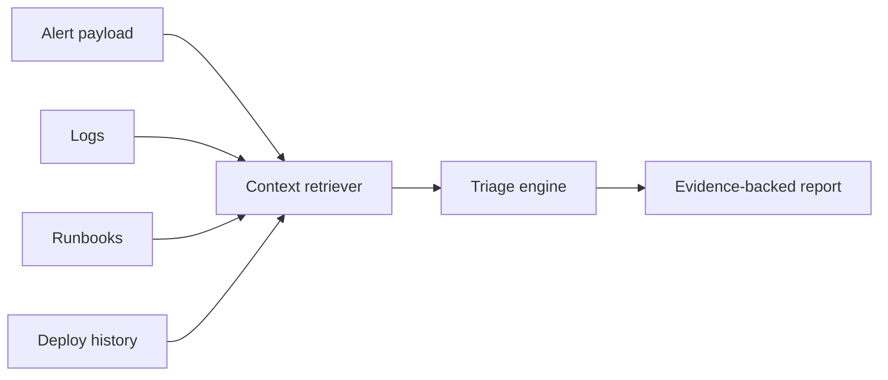

# Architecture Notes

## System Shape

## Design Choices

- The local retriever is deterministic so tests are stable and demos do not depend on network access.
- Evidence is ranked separately by source type, which keeps logs, runbooks, and deploys represented in the final report.
- The triage engine only recommends runbook-backed or evidence-backed actions.
- The report carries assumptions explicitly because incident response decisions should not hide uncertainty.

## Production Evolution

In a production version, the `TriageEngine` boundary would become an orchestration layer around an LLM with tools:

- `search_logs(service, query, window)`
- `query_metrics(service, metric, window)`
- `lookup_deploys(service, since)`
- `retrieve_runbooks(service, symptoms)`
- `create_incident_update(report)`

The model should not directly invent mitigations. It should choose from runbooks, attach supporting evidence, and request human approval for risky steps such as rollback, failover, policy bypass, or customer-impacting configuration changes.

## Evaluation Strategy

The `evals` folder contains expected report properties. A mature system would expand these into:

- golden incident cases
- hallucination checks for unsupported claims
- retrieval recall tests
- action safety tests
- latency and token budget thresholds
- model comparison reports

## Leadership Signal

This project shows AI engineering lead judgment by separating model behavior from system guarantees. The core quality bar is not whether an LLM can write a polished summary; it is whether the system can produce grounded, reviewable, operationally useful incident guidance under pressure.
