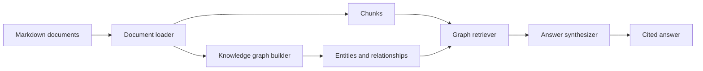

# Architecture Notes

## System Shape

## Design Choices

- The project uses deterministic extraction so local demos and tests are repeatable.
- Document chunks and graph facts are both retrieval inputs.
- Graph expansion helps retrieve related systems and policies even when the question does not use exact document wording.
- The synthesizer is replaceable, so a production LLM can be added without changing ingestion or retrieval.
- Answers include citations and assumptions to make unsupported claims visible.

## Production Evolution

A production version would replace local markdown loading with connectors for internal docs, tickets, design records, service catalogs, and policy stores.

The `LLMAnswerSynthesizer` boundary would call a model with a prompt package containing:

- user question
- retrieved chunks
- graph facts
- citation requirements
- answer schema
- unsupported-claim rules

The model response should be validated before display. Every claim should map back to a chunk, graph fact, or explicit insufficiency statement.

## AI Capabilities Demonstrated

This project demonstrates graph-aware RAG: retrieval is not only based on document text, but also on relationships between systems, teams, policies, and data types. That pattern is useful when enterprise knowledge is fragmented across many documents and important context exists in the relationships between them.
