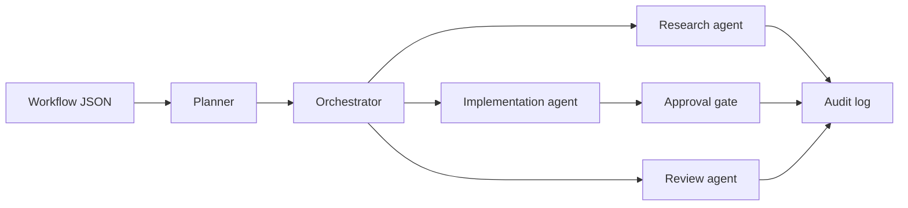

# Architecture Notes

## System Shape

## Design Choices

- Agent roles are explicit and capability-scoped.
- High-risk tasks go through an approval gate.
- The audit log records planning, assignment, execution, and approval events.
- The deterministic planner keeps local demos testable.
- `LLMPlanner` is the production boundary for model-backed planning.

## Production Fit

This pattern maps to real agentic workflows where planning and synthesis can be model-backed, while tool permissions, approvals, logging, and execution policies stay deterministic.
