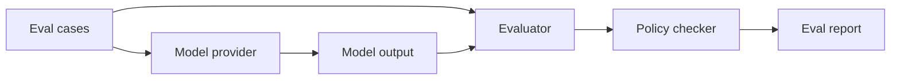

# Architecture Notes

## System Shape

## Design Choices

- The fixture provider makes local runs deterministic and network-free.
- Model calls are isolated behind `ModelProvider`.
- Governance checks are independent from the model provider.
- Reports capture pass/fail, score, missing expected content, forbidden content, and policy violations.

## Production Fit

In production, CI can run this harness against prompts, RAG answers, agent outputs, or support responses. A real `LLMProvider` can replace the fixture model while the same policy checks protect quality gates.
