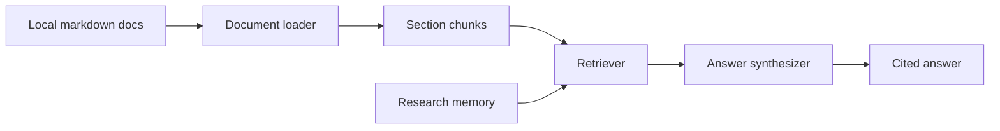

# Architecture Notes

## System Shape

## Design Choices

- The project uses local markdown and JSON files so it runs without network access.
- Retrieval is deterministic for stable tests and easy debugging.
- Memory is explicit and user-controlled rather than silently automatic.
- The LLM boundary receives retrieved chunks, memories, and citation constraints.

## Production Fit

A production version could add PDF parsing, embeddings, vector search, source deduplication, encrypted memory, and a local or remote LLM provider. The core contract should remain the same: answer from retrieved context, cite sources, and expose assumptions.
